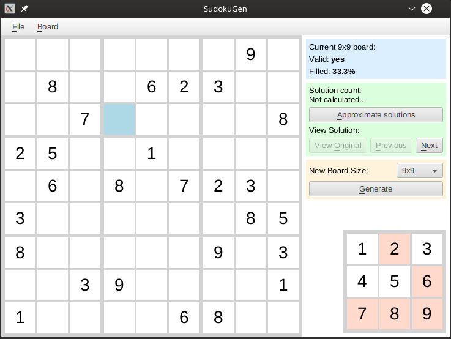

# sudoku-gen

A simple program for solving and generating sudoku puzzles, with a GUI built with ScalaFX.



### Running the project

1. Install Scala build tool from [https://www.scala-sbt.org/](https://www.scala-sbt.org/)

2. Download and open the project directory

3. Compile the project with ```sbt compile```

4. Start the GUI with ```sbt run```

A pre-generated scaladoc HTML documentation for this project is available in the [doc/](doc/) folder.
